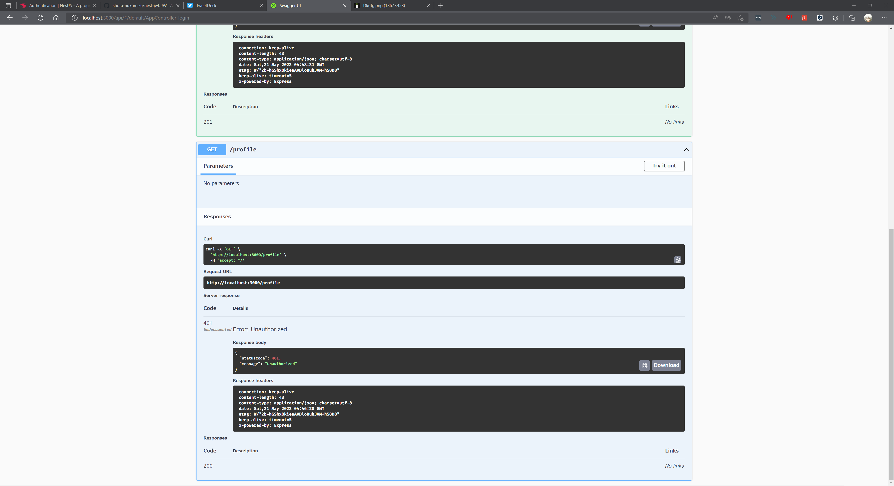

# NestJSでJWT(JSON Web Token)認証

NestJSの認証として推奨されているJWT認証を開発してみた。

# `src`ディレクトリ

```
C:.
│  app.controller.spec.ts
│  app.controller.ts
│  app.module.ts
│  app.service.ts
│  main.ts
│
├─auth
│      auth.module.ts
│      auth.service.spec.ts
│      auth.service.ts
│      constants.ts
│      jwt-auth.guard.ts
│      jwt.strategy.ts
│      local-auth.guard.ts
│      local.strategy.ts
│
└─users
        users.module.ts
        users.service.spec.ts
        users.service.ts
```

# 実装方法

まずは以下のコマンドを叩く。

```powershell
npx nest new nest-jwt
npm install --save @nestjs/passport passport passport-local
npm install --save-dev @types/passport-local
```

Nestのプロジェクトを新規作成した後は、以下のコマンドを叩いて`module`と`service`を作成する

```powershell
npx nest g module auth
npx nest g service auth
```

```powershell
npx nest g module users
npx nest g service users
```

# demo画像



手順は公式docsの通りに実行。正直作成者自身わかっていない部分が数多くある...。

# 参考サイト

[Authentication - NestJS](https://docs.nestjs.com/security/authentication)